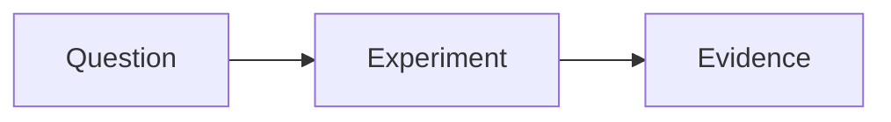

# Customization Guide

This guide walks through every aspect of personalizing your as-folio site.

---

## Table of contents

1. [Deployment config](#1-deployment-config)
2. [Site identity](#2-site-identity)
3. [Profile photo](#3-profile-photo)
4. [Social links](#4-social-links)
5. [About page content](#5-about-page-content)
6. [Blog posts](#6-blog-posts)
7. [Publications (BibTeX)](#7-publications-bibtex) — BibTeX fields, co-author links, citation badges
8. [Projects](#8-projects)
9. [CV](#9-cv)
10. [Books](#10-books)
11. [Teaching](#11-teaching)
12. [People / Lab members](#12-people--lab-members)
13. [Repositories page](#13-repositories-page)
14. [Announcements](#14-announcements)
15. [Dark mode](#15-dark-mode)
16. [Comments (Giscus / Disqus)](#16-comments-giscus--disqus)
17. [Analytics](#17-analytics)
18. [Newsletter](#18-newsletter)
19. [Cookie consent](#19-cookie-consent)
20. [Search](#20-search)
21. [Deployment base path](#21-deployment-base-path)
22. [Enabling / disabling features](#22-enabling--disabling-features)
23. [Custom styles](#23-custom-styles)
24. [Footer position](#24-footer-position)

---

## 1. Deployment config

Deployment is env-first. These values flow through the app like this:

```text
ASTRO_SITE / ASTRO_BASE
→ astro.config.mjs
→ import.meta.env.SITE / import.meta.env.BASE_URL
→ src/config/site.ts
```

That means `src/config/site.ts` reads the resolved deployment values, but it is not the
source of truth for them.

### Local development

Copy `.env.example` to `.env`, then set:

```dotenv
ASTRO_SITE=https://username.github.io
ASTRO_BASE=
```

For a project page:

```dotenv
ASTRO_SITE=https://username.github.io
ASTRO_BASE=/repo-name
```

Rules:

- `ASTRO_SITE` should be the site origin only, with no trailing slash
- use `ASTRO_BASE=` for root deployments
- if you accidentally set `ASTRO_BASE=/`, the config normalizes it back to `''`

### GitHub Pages

In your fork, set repository variables in **Settings** → **Secrets and variables** → **Actions**:

- `ASTRO_SITE`
- `ASTRO_BASE`

The deploy workflow reads those variables and passes them to the Astro build.

---

## 2. Site identity

Edit `src/config/site.ts`:

```typescript
export const site = {
  title: 'Your Name',
  description: 'Brief description of your site',
  lang: 'en',

  author: {
    name: 'Your Name',
    email: 'you@example.com',
    subtitle: 'Professor of Physics · MIT',
    researchInterests: [
      'Knowledge Representation and Reasoning',
      'Logical Reasoning with Large Language Models',
      'Recommender Systems',
    ],
    moreInfo: `
      <p>Department of Physics</p>
      <p>77 Massachusetts Avenue</p>
      <p>Cambridge, MA 02139</p>
    `,
  },
};
```

`subtitle` and `moreInfo` support HTML. Each item in `researchInterests` appears on its own
row on the home page.

`url` and `base` in `site.ts` are derived from Astro's resolved environment, so you normally
should not edit them directly. Use `ASTRO_SITE` and `ASTRO_BASE` instead.

---

## 3. Profile photo

Place the home-page and CV portraits in `public/assets/img/`.

Update the path in `site.ts`:

```typescript
author: {
  avatar: '/assets/img/profile-life.jpg',
  avatarPosition: '68% 50%',
},
cv: {
  photoPath: '/assets/img/profile-cv.jpg',
  photoPosition: '50% 35%',
}
```

The home-page photo is displayed in a 4:5 portrait frame. Use `avatarPosition` and
`photoPosition` to adjust each crop without editing the original image.

---

## 4. Social links

Set any platform to `undefined` to hide it:

```typescript
socials: {
  email: 'you@example.com',
  github_username: 'your-github',
  x_username: undefined,               // hide X/Twitter
  linkedin_username: 'your-linkedin',
  scholar_userid: 'YOUR_SCHOLAR_ID',   // part after user= in Scholar URL
  orcid_id: '0000-0000-0000-0000',
  inspire_id: undefined,
  researchgate_username: undefined,
  arxiv_id: undefined,
  youtube_id: undefined,
  instagram_username: undefined,
  mastodon_url: undefined,
  bluesky_handle: 'you.bsky.social',
  medium_username: undefined,
  cv_pdf: '/assets/pdf/cv.pdf',        // link to your CV PDF
  rss_icon: true,
},
```

---

## 5. About page content

Edit `src/pages/index.astro` to change the bio text. The About page auto-pulls from:

- **Announcements**: up to `site.announcements.limit` items from `src/content/announcements/`
- **Latest posts**: up to `site.latestPosts.limit` posts from `src/content/blogs/`
- **Selected papers**: entries with `selected = {true}` in `src/data/papers.bib`

All three sections can be disabled in `site.ts`.

---

## 6. Blog posts

Create `.md` or `.mdx` files in `src/content/blogs/`. This directory is loaded as the `blogs`
content collection and corresponds to **Blogs** in the navigation. Entries are published at
`/blog/<filename>/`.

For example, save a Jev study note as `src/content/blogs/learning-jev-basics.md`, with
`categories: [Learning Notes]` and `tags: [Jev]` in its frontmatter.

Example frontmatter and body:

```yaml
---
title: "Post Title"
date: 2024-06-01
lastmod: 2024-09-01  # optional: last modified date — shown in header and JSON-LD
description: "Shown in listings and meta tags"
tags: [physics, math]
categories: [science]
math: true           # optional compatibility flag; KaTeX rendering is automatic
toc: true            # sidebar table of contents (default: true)
pinned: false        # pin to top of blog listing
hidden: false        # hide from listing (accessible via URL)
draft: false         # exclude from listings and search index until published
image: /assets/img/post-thumb.jpg
---

Post body in Markdown/MDX.

Inline math: $E = mc^2$

Display math:
$$
\int_{-\infty}^{\infty} e^{-x^2} dx = \sqrt{\pi}
$$
```

KaTeX is configured globally for blog Markdown, so inline and display formulas are
rendered during the build. Mermaid is enabled by default and its browser library is
downloaded only when a post contains a `mermaid` code fence:

````markdown

````

### Blog listing options

Control the research-notebook directory, visible topic filters, reading-speed estimate, and the
empty-state message:

```typescript
blog: {
  collections: [
    {
      name: 'Paper Reading',
      icon: 'book',
      description: 'Structured reviews, critiques, and connections across papers.',
    },
  ],
  displayCategories: ['Paper Reading', 'Learning Notes'],
  displayTags: ['RAG', 'Reinforcement Learning', 'Research Workflow'],
  wordsPerMinute: 200,              // used to calculate estimated reading time
  emptyTitle: 'Posts Coming Soon',
  emptyMessage: 'Research notes and personal updates will be published here.',
},
```

Keep `collections` and `displayCategories` aligned. Use one stable category per post and tags for
topics that cross categories. This site uses the following file conventions so the post directory
remains easy to scan:

```text
paper-reading-<topic>.md
research-update-<date>.md
learning-rag-<topic>.md
learning-rl-<topic>.md
technical-<topic>.md
daily-<date>.md
```

Posts in the listing are grouped by year automatically.

### MDX components available in posts

```mdx
import VideoEmbed from '@components/VideoEmbed.astro';
import AudioPlayer from '@components/AudioPlayer.astro';
import Tabs from '@components/Tabs.astro';

<VideoEmbed src="https://www.youtube.com/watch?v=..." />
<AudioPlayer src="/assets/audio/demo.mp3" />
```

### Per-post CDN widgets

Enable in frontmatter:

| Flag                   | What it loads           |
| ---------------------- | ----------------------- |
| `mermaid: false`       | Disable Mermaid rendering for this post |
| `chart_js: true`       | Chart.js                |
| `echarts: true`        | Apache ECharts          |
| `vega: true`           | Vega/Vega-Lite          |
| `plotly: true`         | Plotly.js               |
| `pseudocode: true`     | pseudocode.js           |
| `typograms: true`      | Typograms               |
| `tikzjax: true`        | TikzJax                 |
| `map: true`            | Leaflet maps            |
| `img_comparison: true` | Image comparison slider |
| `code_diff: true`      | Diff2Html               |
| `gallery: true`        | PhotoSwipe gallery      |

---

## 6. Publications (BibTeX)

Edit `src/data/papers.bib`. Standard BibTeX format with extra as-folio fields:

```bibtex
@article{yourkey2024,
  % ── Standard BibTeX fields ──────────────────────────────────────────────
  title    = {Your Paper Title},
  author   = {Your Name and Coauthor Name},
  journal  = {Journal of Example},
  year     = {2024},
  volume   = {42},
  pages    = {1--10},
  doi      = {10.1000/xyz123},

  % ── Display / layout ────────────────────────────────────────────────────
  selected    = {true},               % show on About page under Selected Publications
  abbr        = {J. Ex.},             % short venue badge (e.g. NeurIPS, Nature)
  abstract    = {Your abstract.},
  annotation  = {Short note shown below authors as italic tooltip.},
  additional_info = {Workshop version also presented at ICML.},
  preview     = {paper-thumb.jpg},    % relative to publications.previewDir
  award       = {Best Paper Award},
  award_name  = {Best Paper},         % short badge label (defaults to award text)
  bibtex_show = {true},               % show Bib button (copies clean BibTeX)

  % ── Links ───────────────────────────────────────────────────────────────
  html    = {https://journal.example.com/article},  % landing page
  pdf     = {https://arxiv.org/pdf/...},            % URL or local path (relative to pdfDir)
  arxiv   = {2400.00001},                           % arXiv ID — auto-links to arxiv.org
  hal     = {hal-00000000},                         % HAL ID — auto-links to hal.science
  code    = {https://github.com/you/repo},
  slides  = {/assets/pdf/talk.pdf},
  poster  = {/assets/pdf/poster.pdf},
  supp    = {/assets/pdf/supplemental.pdf},
  video   = {https://www.youtube.com/watch?v=...},
  blog    = {https://example.com/blog-post},
  website = {https://project-page.example.com},

  % ── Citation metric badges (all optional) ───────────────────────────────
  google_scholar_id = {PAPER_ID},   % paper-level Scholar ID (from citation_for_view= in URL)
  altmetric         = {true},       % {true} uses DOI; or supply an explicit Altmetric ID
  dimensions        = {true},       % {true} uses DOI
  inspirehep_id     = {12345},      % InspireHEP literature record ID
}
```

The publication page groups entries by year, newest first. BibTeX is parsed at build time — no runtime dependency.

### Author highlighting and asset paths

The publication list italicises **your name** in author lists. Configure in `site.ts`:

```typescript
publications: {
  /** Last name used to italicise your name in author lists.
   *  Defaults to the last word of site.author.name — usually correct without setting. */
  authorLastName: undefined,   // e.g. 'Einstein' — omit to auto-derive

  /** Max authors shown before "and N more..." link. undefined = always show all. */
  maxAuthorLimit: 3,

  /** Show thumbnail images when `preview` is set in BibTeX. */
  thumbnails: true,

  /** Directory prefix for thumbnail images (value of the `preview` BibTeX field). */
  previewDir: '/assets/img/publication_preview/',

  /** Directory prefix for local PDF files (value of the `pdf` BibTeX field). */
  pdfDir: '/assets/pdf/',

  /** Enable or disable metric badge types globally. */
  badges: {
    altmetric: true,
    dimensions: true,
    googleScholar: true,
    inspirehep: true,
  },

  /** UI labels — override to translate or rename buttons. */
  labels: {
    abstract: 'Abs',
    bibtex: 'Bib',
    supp: 'Supp',
    searchPlaceholder: 'Search publications…',
    noResults: 'No publications match your search.',
    totalCitations: 'Google Scholar Citations',
  },
},
```

`authorLastName` auto-derives from `site.author.name`, so most users never need to set it explicitly.

### Co-author links

Add co-author profile links to `src/data/coauthors.yml`. Any author whose last name matches a key will get a hyperlink on the publications page:

```yaml
# src/data/coauthors.yml
# Key is the author's last name as it appears in the BibTeX `author` field.
Einstein:
  url: https://en.wikipedia.org/wiki/Albert_Einstein
  scholar: qc6CJjYAAAAJ
  orcid: 0000-0000-0000-0000

Podolsky:
  url: https://en.wikipedia.org/wiki/Boris_Podolsky
```

Supported keys per entry: `url` (profile link), `scholar` (Google Scholar ID), `orcid`.

### Citation counts

Citation counts for Google Scholar badges come from `src/data/citations.yml`, keyed by the `google_scholar_id` BibTeX field:

```yaml
# src/data/citations.yml — auto-generated, do not edit by hand
qyhmnyLat1gC: 14200 # EPR paper
```

**Refreshing counts:**

```bash
yarn citations:update
```

This calls the [OpenAlex API](https://openalex.org) (free, no auth) to fetch current counts for every paper that has both `doi` and `google_scholar_id` set. Results are written back to `citations.yml`.

`citations.yml` is refreshed at the start of every production build and by the weekly GitHub Actions workflow (`.github/workflows/update-citations.yml`). The workflow commits the updated file back to the repo if any counts changed. The publications header totals the counts for the papers currently listed.

---

## 7. Projects

Create `.md` files in `src/content/projects/`:

```yaml
---
title: 'Project Name'
description: 'What this project does'
img: /assets/img/projects/my-project.jpg
img_alt: 'Screenshot of the project'
github: username/repo # links to GitHub
github_stars: username/repo # shows live star count
url: https://project-website.com # external URL
importance: 1 # sort order (lower = first)
category: open source # groups cards under this heading
redirect: https://external-url.com # redirect instead of showing project page
related_publications: [key1, key2] # cite from papers.bib
giscus_comments: false
---
Project description content (Markdown).
```

Add images to `public/assets/img/projects/`.

Set the subtitle shown below the page heading in `site.ts`:

```typescript
pages: {
  projects: {
    description: 'A growing collection of your cool projects.',
    emptyTitle: 'Projects Coming Soon',
    emptyMessage: 'Selected research and software projects will be added here.',
  },
},
```

The same `emptyTitle` and `emptyMessage` fields are available under `pages.teaching`,
`pages.people`, `pages.books`, and `pages.repositories`. They keep unfinished sections visible
until real entries are added to their content directories.

---

## 8. CV

The CV page supports two formats — switch with `site.cv.format`.

### RenderCV format (`src/data/cv.yml`)

```yaml
cv:
  name: Your Name
  label: Professor of Physics
  email: you@example.com

  sections:
    education:
      - institution: MIT
        area: Physics
        studyType: PhD
        startDate: '2010-09-01'
        endDate: '2015-06-01'
    experience:
      - company: Your University
        position: Professor
        startDate: '2015-09-01'
        endDate: 'present'
        highlights:
          - Teaching and research
```

### JSONResume format (`src/data/resume.json`)

Standard [JSONResume](https://jsonresume.org/) schema.

### CV PDF

Place your CV PDF in `public/assets/pdf/` and set:

```typescript
cv: {
  pdfPath: '/assets/pdf/your-cv.pdf',
}
```

---

## 9. Books

Create `.md` files in `src/content/books/`:

```yaml
---
title: 'Book Title'
author: Author Name
isbn: '9780000000000' # for Open Library cover lookup
olid: 'OL00000000M' # Open Library ID (alternative to ISBN)
cover: /assets/img/book_covers/mybook.jpg # or use ISBN/OLID
status: finished # reading | finished | queued | paused | abandoned | interested | reread
stars: 5 # 1–5
started: 2024-01-01
finished: 2024-03-15
released: 1984 # original publication year
categories: science fiction
buy_link: https://bookshop.org/...
goodreads_review: '123456789'
importance: 1 # sort order within the same year
---
Optional personal notes about the book.
```

Books are grouped by year read (most recent first). Books without dates go in a "To Read" section.

---

## 10. Teaching

Create `.md` files in `src/content/teaching/`:

```yaml
---
title: 'Introduction to Quantum Mechanics'
code: 'PHYS 401'
description: 'Undergraduate course covering wave functions and operators'
term: 'Spring 2024'
institution: 'Your University'
url: https://course-website.example.com
importance: 1
category: current # 'current' or 'past'
---
Course description content (optional).
```

Set the subtitle shown below the page heading in `site.ts`:

```typescript
pages: {
  teaching: {
    description: 'Course materials, schedules, and resources for classes taught.',
  },
},
```

---

## 11. People / Lab members

Create `.md` files in `src/content/people/`:

```yaml
---
name: 'Lab Member Name'
role: 'PhD Student'
photo: /assets/img/people/member.jpg
description: 'Research interests: quantum computing, information theory'
website: https://member-site.com
github: github-username
scholar: SCHOLAR_ID
orcid: 0000-0000-0000-0000
importance: 1
group: current # 'current' or 'alumni'
---
```

---

## 12. Repositories page

Edit `src/data/repositories.yml`:

```yaml
github_users:
  - your-github-username
  - collaborator-username

github_repos:
  - username/repo-name
  - username/another-repo
```

The page renders GitHub user stat cards and repo pins via `github-readme-stats` (image URLs, no API key required).

Themes are configured in `site.ts`:

```typescript
repositories: {
  githubUsers: true,
  githubRepos: true,
  trophies: true,
  themeLight: 'default',      // github-readme-stats theme for light mode
  themeDark: 'dark',          // github-readme-stats theme for dark mode
  trophyThemeLight: 'flat',   // github-profile-trophy theme for light mode
  trophyThemeDark: 'gitdimmed', // github-profile-trophy theme for dark mode
},
```

Browse available themes at [github-readme-stats themes](https://github.com/anuraghazra/github-readme-stats/blob/master/themes/README.md) and [github-profile-trophy themes](https://github.com/ryo-ma/github-profile-trophy#themes).

---

## 13. Announcements

Create `.md` files in `src/content/announcements/`:

```yaml
---
date: 2024-06-01
pinned: false
---
Announcement text here. HTML and Markdown are supported.
[Link text](https://example.com) works too.
```

Announcements appear on the About page (if `site.announcements.enabled: true`) and on the dedicated `/news` page.

---

## 14. Dark mode

Dark mode is enabled by default (`site.features.darkmode: true`). The initial theme follows the OS preference.

To default to a specific theme:

```typescript
theme: {
  default: 'light',   // 'light' | 'dark' | 'system'
},
```

Users can always toggle with the sun/moon button in the navbar.

### Theme color

Override the primary accent color (used for links, active nav items, buttons, and badges)
in `site.ts`:

```typescript
theme: {
  default: 'system',
  color: {
    light: '#b509ac',  // accent color in light mode (any CSS color string)
    dark: '#2698ba',   // accent color in dark mode
  },
},
```

Set either value to `'auto'` to keep the built-in default for that mode.

**Preset palettes:**

| Name             | `light`   | `dark`    |
| ---------------- | --------- | --------- |
| Purple (default) | `#b509ac` | `#2698ba` |
| Blue             | `#0076df` | `#68c0d9` |
| Red              | `#ff3636` | `#f29105` |
| Green            | `#009f06` | `#b7d12a` |
| Orange           | `#f29105` | `#efcc00` |

---

## 15. Comments (Giscus / Disqus)

### Giscus (GitHub Discussions — recommended)

1. Go to [giscus.app](https://giscus.app) and follow the setup instructions
2. Copy the values into `site.ts`:

```typescript
giscus: {
  enabled: true,
  lazyLoad: true,
  repo: 'username/repo',
  repoId: 'R_...',
  category: 'Comments',
  categoryId: 'DIC_...',
  mapping: 'title',
  strict: true,
  reactionsEnabled: true,
  inputPosition: 'bottom',
  darkTheme: 'dark',
  lightTheme: 'light',
  lang: 'en',
  labels: {
    noticeBefore: 'Comments are powered by',
    provider: 'Giscus',
    noticeAfter: '(GitHub Discussions). Loading them fetches resources from GitHub.',
    load: 'Load comments',
  },
},
```

Giscus appears on all blog posts. With `lazyLoad: true`, the external script loads only after
the reader selects the configured load button. Enable per-project with `giscus_comments: true`
in project frontmatter.

### Disqus

Set your Disqus shortname in `site.ts` (leave empty to disable):

```typescript
comments: {
  disqusShortname: 'your-disqus-shortname',
},
```

Find your shortname in your Disqus admin dashboard → Settings → General → Shortname. Disqus and Giscus can coexist — both will appear on posts if both are configured.

---

## 16. Analytics

Set any analytics provider in `site.ts` (leave others as empty string `''`):

```typescript
analytics: {
  ga4: 'G-XXXXXXXXXX',          // Google Analytics 4
  cronitor: 'YOUR_SITE_ID',     // Cronitor RUM
  pirsch: 'YOUR_CODE',          // Pirsch.io
  openpanel: 'YOUR_CLIENT_ID',  // OpenPanel
  googleVerification: '',       // Google Search Console
  bingVerification: '',         // Bing Webmaster
},
```

All analytics scripts are loaded via Partytown (web worker) to avoid blocking the main thread. Only non-empty strings are injected.

---

## 17. Newsletter

Integration with [Loops.so](https://loops.so):

1. Create a form in Loops and copy the form endpoint
2. Enable in `site.ts`:

```typescript
features: {
  newsletter: true,
},
newsletter: {
  endpoint: 'https://app.loops.so/api/newsletter-form/YOUR_ID',
},
```

The newsletter form appears in the footer.

---

## 18. Cookie consent

Enable GDPR-compliant cookie consent:

```typescript
features: {
  cookieConsent: true,
},
```

The dialog uses [vanilla-cookieconsent](https://github.com/orestbida/cookieconsent) loaded from CDN. Users must accept before analytics scripts run.

---

## 19. Search

Search is enabled by default. It's powered by [Pagefind](https://pagefind.app) (build-time index) with [ninja-keys](https://github.com/ssleptsov/ninja-keys) for the ⌘K command palette UI.

To disable:

```typescript
features: {
  search: false,
},
```

The search index is rebuilt on every `yarn build` run.

---

## 20. Deployment base path

**User/org pages** (`username.github.io`):

```dotenv
ASTRO_SITE=https://username.github.io
ASTRO_BASE=
```

**Project pages** (`username.github.io/repo-name`):

```dotenv
ASTRO_SITE=https://username.github.io
ASTRO_BASE=/repo-name
```

`ASTRO_SITE` should not include the repo path or a trailing slash.

---

## 21. Enabling / disabling features

All feature flags live in the `features` block of `site.ts`:

```typescript
features: {
  darkmode: true,       // dark/light toggle in navbar
  search: true,         // ⌘K search
  progressBar: true,    // reading progress bar on posts
  backToTop: true,      // floating back-to-top button
  masonry: true,        // auto masonry layout for projects
  mediumZoom: true,     // click-to-zoom on images
  cookieConsent: false, // GDPR cookie dialog
  newsletter: false,    // newsletter form in footer
  videoEmbedding: false,// embed video links in bib entries
},
```

---

## 22. Custom styles

All theming is done through CSS custom properties defined in `src/styles/_colors.css`. Override them to change colors, fonts, and spacing site-wide:

```css
:root {
  --global-theme-color: #b509ac; /* accent color (default: purple) */
  --global-bg-color: #ffffff;
  --global-text-color: #000000;
  /* ... see _colors.css for full list */
}

[data-theme='dark'] {
  --global-theme-color: #b509ac;
  --global-bg-color: #1a1a1a;
  --global-text-color: #e0e0e0;
}
```

The easiest way to change the accent color is via `site.ts` (see §14 — Dark mode → Theme color). For other CSS variable overrides (background, text, borders, fonts, etc.), edit `src/styles/_colors.css` directly.

---

## 23. Footer position

Control where and whether the footer appears with `site.footer.position`:

```typescript
footer: {
  text: 'Powered by as-folio.',
  lastUpdated: false,
  impressum: undefined,
  position: 'sticky',   // 'sticky' | 'normal' | 'hidden'
},
```

| Value      | Behaviour                                                                                 |
| ---------- | ----------------------------------------------------------------------------------------- |
| `'sticky'` | Footer is always visible at the bottom of the viewport (default, matches al-folio)        |
| `'normal'` | Footer sits at the natural bottom of the page content — only visible after scrolling down |
| `'hidden'` | Footer is not rendered at all                                                             |

When `'sticky'`, the body automatically gains `padding-bottom` to prevent page content from being obscured by the footer. The back-to-top button is also repositioned to sit above it.

## Submission venue directory

The Chinese submission notebook is published at `/blog/submission-venue-directory/`.
Set `site.submissionDirectory.enabled` to show or hide its embedded directory.
All filter labels, subject names and source-PDF paths live in `src/config/site.ts`.

Edit `src/data/submission-venues.json` to maintain the directory. The `venues`
collection in `src/content.config.ts` validates it during the build:

- Keep a stable `id` per journal or conference. Do not merge journals and conferences
  just because their acronyms match. Keep former names in `aliases` and add
  `issn`/`eissn` when verified.
- `ccf` stores every subject membership, with `area` (`ai`, `theory`, `data`,
  `cross`), `rank`, `year`, physical PDF `page`, and source row `order`.
  DKE, IJIS and IPL each have multiple memberships but share their journal record.
- `rankings` is empty until verified. Each entry must have `scheme` (`cas`,
  `xinrui`, `jcr`), `year`, `zone` (`1`–`4`), `category`, `scope`, a `source` URL,
  and `verifiedAt`. Describe major/minor subject scope explicitly. Do not translate
  a JCR quartile into a CAS or Xinrui partition. Conference rankings must stay empty.
- The ranking filter derives its options from verified data and combines them with
  CCF, subject, type and text filters. Ranking badges show scheme, year, partition,
  subject and scope, link to evidence, and expose the verification date on hover.
- `sourceUrls` preserves PDF references, which are usually DBLP links, not submission
  systems. `notes` records source anomalies. Entries with such notes link only to
  the source PDF until their references are resolved.
- The current view covers only the four CCF areas. Adding non-CCF journals later
  also requires extending the view to include records without CCF memberships.

Source: the user-supplied seventh-edition PDF, whose cover says 2026, archived as
`public/assets/pdf/ccf-2026-v7.pdf`. This transcription does not independently certify
the supplied edition against the live CCF website. It contains 282 memberships and
279 distinct entities (158 journals and 121 conferences). Update the note's counts,
provenance and change log when the source changes. Run `yarn build`, `yarn check`,
and `yarn lint:ci` after changes.

## Homepage visitor map

`site.visitors` controls the MapMyVisitors widget at the bottom of the homepage:

- `enabled` toggles the section. Empty `scriptUrl` or `statisticsUrl` also hides it.
- `scriptUrl` is the official JavaScript installation URL, using HTTPS and `w=a`
  for automatic width. Keep the `d` value from your own installation code.
- `imageUrl` is the official plain-image alternative for the same profile. It is
  inside `noscript`, so JavaScript-enabled visits do not load both trackers.
- `statisticsUrl` links to the matching public report, currently
  <https://mapmyvisitors.com/web/1c8mp>.
- `maxWidth` limits the centered map width; smaller screens use the available width.
  `labels` contains the alternative text, link and caption copy. The map is shown
  without a separate section heading.

Installation code: <https://mapmyvisitors.com/profile/1c8mp/widget/code/map>.
`VisitorMap.astro` places the external script with `id="mapmyvisitors"` inside the
page body, as required by the provider. `is:inline` preserves the external embed;
`async` avoids blocking page parsing, and `data-astro-rerun` reloads the widget when
Astro's client router returns to the homepage. This is a visible DOM widget, so it
runs in the main page rather than the Partytown analytics worker.

Only the homepage embeds the tracker. Locations and counts follow MapMyVisitors'
definitions and update schedule; historical data belongs to the configured profile.
Keep the provider resources live: downloading or proxy-caching the tracker would
prevent normal visitor tracking. Ad blockers or provider outages can prevent the
widget from loading; the public statistics link remains available below the map.
