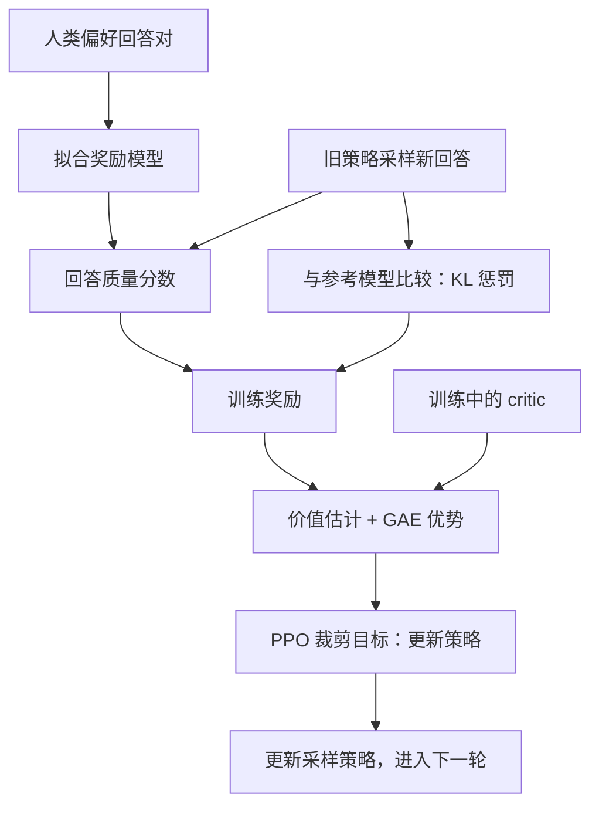
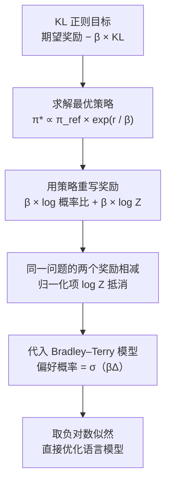
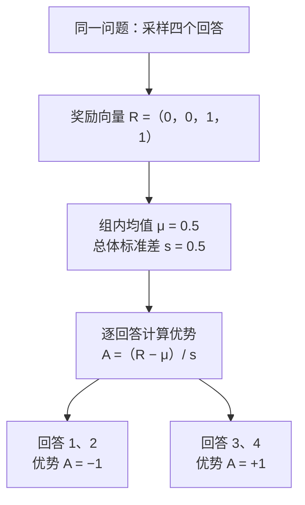

强化学习研究如何通过决策获得更高的长期回报。一个动作不仅影响当下的奖励，还会改变未来遇到的状态，因此，学习的核心同时涉及**长期价值的估计、行为结果的归因，以及策略的稳定改进**。

本文沿着这三个问题展开：先用马尔可夫决策过程建立统一语言，再从价值学习进入策略梯度与 PPO。大语言模型部分按照 **RLHF（PPO）→ DPO → GRPO** 的顺序学习：先理解显式奖励模型与策略优化，再推导直接偏好优化，最后讨论基于组内相对奖励的在线学习。这个顺序描述的是知识联系，三种方法仍各有适用条件。

基础讲解以 Xin Zhang 的《Reinforcement Learning — Study Notes: From the basics to PPO and GRPO》为线索 [1]，DPO 部分依据 Rafailov 等人的原始论文补充 [12]。各节参考文献列于文末。

## 1. 用 MDP 描述序列决策

### 1.1 状态、动作与奖励

马尔可夫决策过程（Markov Decision Process，MDP）可写为

$$
\mathcal M=(\mathcal S,\mathcal A,P,r,\gamma,\rho_0).
$$

其中，$\mathcal S$ 是状态空间，$\mathcal A$ 是动作空间，$P(s'\mid s,a)$ 是状态转移概率，$r(s,a)$ 是即时奖励的条件期望，$\gamma$ 是折扣因子，$\rho_0$ 是初始状态分布。策略 $\pi(a\mid s)$ 给出状态 $s$ 下选择动作 $a$ 的概率。

本文统一约定：在状态 $s_t$ 执行动作 $a_t$，获得奖励 $r_t$，并转移到 $s_{t+1}$。部分教材把同一个奖励记为 $R_{t+1}$，只是下标约定不同。

马尔可夫性要求：**当前状态已包含预测下一步所需的历史信息**。它并不意味着环境没有历史，而是要求历史对未来的影响可以通过状态表达。如果机器人只看到一张无法判断速度的图像，这个观察未必满足马尔可夫性；可以通过加入历史帧或维护信念状态改善表示。[2]

### 1.2 奖励与回报

有限回合在 $T$ 时刻结束，从时刻 $t$ 开始的折扣回报为

$$
G_t=\sum_{k=t}^{T-1}\gamma^{k-t}r_k,
\qquad G_t=r_t+\gamma G_{t+1}.
$$

**奖励是一步的反馈，回报是后续奖励的累计。** 例如，一个动作立即获得 $1$ 分，另一个动作立即得 $0$ 分、下一步得 $5$ 分。在 $\gamma=0.9$ 时，后者的回报为 $4.5$，尽管其即时奖励更低。

策略优化的目标是

$$
J(\theta)=\mathbb E_{s_0\sim\rho_0,\,\tau\sim\pi_\theta}[G_0].
$$

这里 $\tau$ 表示一条交互轨迹。无限时域、奖励有界时，通常取 $0\leq\gamma<1$ 以保证回报有限；对于会终止的有限任务，可以取 $\gamma=1$。折扣也表达了对近期与远期收益的不同权重。

### 1.3 强化学习为什么需要探索

监督学习的数据通常先给定，强化学习中的策略会参与决定下一批数据来自哪里。如果一个动作从未被尝试，就很难知道它是否优于当前选择。这形成了探索与利用的权衡。

常见的 $\varepsilon$-greedy 策略以 $1-\varepsilon$ 的概率选择当前估值最高的动作，以 $\varepsilon$ 的概率随机探索。它容易实现，但在长程、稀疏奖励任务中，随机动作不一定能发现有效路径。探索困难不会因为换成更大的神经网络就自动消失。

## 2. 价值函数与 Bellman 方程

### 2.1 价值描述长期结果

给定策略 $\pi$，状态价值和动作价值分别为

$$
V^\pi(s)=\mathbb E_\pi[G_t\mid s_t=s],
\qquad
Q^\pi(s,a)=\mathbb E_\pi[G_t\mid s_t=s,a_t=a].
$$

$V^\pi(s)$ 回答“从这里继续遵循策略，平均能得到多少回报”；$Q^\pi(s,a)$ 回答“现在先做这个动作，再遵循策略，平均能得到多少回报”。二者满足

$$
V^\pi(s)=\sum_a\pi(a\mid s)Q^\pi(s,a).
$$

从 $G_t=r_t+\gamma G_{t+1}$ 出发，对动作和下一状态取条件期望，得到 Bellman 期望方程：

$$
\begin{aligned}
Q^\pi(s,a)&=r(s,a)+\gamma\sum_{s'}P(s'\mid s,a)V^\pi(s'),\\
V^\pi(s)&=\sum_a\pi(a\mid s)
\left[r(s,a)+\gamma\sum_{s'}P(s'\mid s,a)V^\pi(s')\right].
\end{aligned}
$$

其原理是把一个很长的预测问题拆成“眼前奖励 + 下一状态的价值”。终止状态的后续价值规定为零。

### 2.2 策略评估与策略改进

期望方程评估的是**某个给定策略**。寻找最优行为时，则使用 Bellman 最优方程：

$$
Q^*(s,a)=r(s,a)+\gamma\sum_{s'}P(s'\mid s,a)\max_{a'}Q^*(s',a').
$$

这里的 $\max$ 表示下一步按照最优动作继续，而不再对给定策略求平均。知道 $Q^*$ 后，可以构造贪心策略 $\pi^*(s)\in\arg\max_aQ^*(s,a)$。

在有限 MDP、$\gamma<1$ 且模型已知时，Bellman 算子具有收缩性质，反复更新可以逼近其固定点。这是动态规划方法的基础。在转移模型未知时，需要利用实际样本近似这些期望。[2]

### 2.3 优势函数是相对评价

定义

$$
A^\pi(s,a)=Q^\pi(s,a)-V^\pi(s).
$$

优势衡量这个动作比“当前策略在同一状态下的平均表现”好多少，而不是动作本身得了多少分。假设两个动作的 $Q$ 值是 $8$ 和 $4$，当前策略各以一半概率选择它们，则 $V=6$，两个优势分别为 $2$ 和 $-2$。

因此，即便某个动作回报为正，它仍可能具有负优势。并且

$$
\mathbb E_{a\sim\pi(\cdot\mid s)}[A^\pi(s,a)]=0.
$$

这个性质连接了价值估计与策略更新：提高正优势动作的概率，降低负优势动作的概率。

## 3. 从 Monte Carlo 到 TD、SARSA 与 DQN

### 3.1 Monte Carlo：用完整结果修正估计

Monte Carlo（MC）方法等待一个回合结束，再使用实际回报更新：

$$
V(s_t)\leftarrow V(s_t)+\alpha[G_t-V(s_t)].
$$

对固定策略下完整、正确采样的回合，$G_t$ 是对应状态价值的无偏样本。但它累积了许多步的随机性，方差可能很大，而且必须等到回合结束才能知道目标。

### 3.2 Temporal Difference：用下一步估计修正当前估计

TD(0) 用一步奖励加下一状态估值构造目标：

$$
\begin{aligned}
\delta_t&=r_t+\gamma V(s_{t+1})-V(s_t),\\
V(s_t)&\leftarrow V(s_t)+\alpha\delta_t.
\end{aligned}
$$

$\delta_t$ 是 TD 误差。用当前估计作为目标的一部分，称为自举（bootstrapping）。它不需要等待完整回合，通常降低目标方差，但也会把下一状态的估计误差带回来。

课件中的通勤例子可以这样理解：出发时预计总行程 $30$ 分钟；走了 $10$ 分钟后，对剩余行程的估计改为 $18$ 分钟。新证据支持的总行程是 $28$ 分钟，于是原先的 $30$ 分钟估计应向 $28$ 分钟移动。这个例子把时间当作待预测的成本，原理与奖励价值的 TD 更新相同。

MC 与 TD 的偏差、方差比较应结合具体估计器理解。TD 并不意味着最终必然有偏：在适当条件下，表格型 TD 可以收敛到正确价值；问题主要在于有限数据、自举目标和函数逼近带来的误差。

### 3.3 SARSA 与 Q-learning：目标策略是否相同

SARSA 使用实际采样到的下一动作 $a_{t+1}$：

$$
Q(s_t,a_t)\leftarrow Q(s_t,a_t)+\alpha
\left[r_t+\gamma Q(s_{t+1},a_{t+1})-Q(s_t,a_t)\right].
$$

它基于 $(s_t,a_t,r_t,s_{t+1},a_{t+1})$ 更新，名称由此而来。标准 SARSA 是 on-policy：用于交互的行为策略和被评估、改进的目标策略一致。因此，探索动作的后果也进入其价值估计。

Q-learning 则使用下一状态下的最大动作价值：

$$
Q(s_t,a_t)\leftarrow Q(s_t,a_t)+\alpha
\left[r_t+\gamma\max_{a'}Q(s_{t+1},a')-Q(s_t,a_t)\right].
$$

即便数据通过 $\varepsilon$-greedy 策略收集，更新目标仍指向贪心策略，所以它是 off-policy。**On-policy 与 off-policy 的区别是行为策略和目标策略的关系，不是是否使用神经网络，也不是是否有 replay buffer。** 表格型 Q-learning 的收敛还需要充分访问状态动作对、适当学习率等条件。[2]

### 3.4 DQN：把 Q 表换成可泛化的函数

DQN 使用神经网络 $Q_\theta(s,a)$ 近似动作价值。典型训练目标为

$$
\begin{aligned}
y_t&=r_t+\gamma(1-d_t)\max_{a'}Q_{\theta^-}(s_{t+1},a'),\\
\mathcal L_Q(\theta)&=\mathbb E_{(s_t,a_t,r_t,s_{t+1},d_t)\sim\mathcal B}
\left[(Q_\theta(s_t,a_t)-\operatorname{sg}(y_t))^2\right].
\end{aligned}
$$

$d_t$ 标记任务真正终止，$\mathcal B$ 是经验回放池，$\theta^-$ 是目标网络参数，$\operatorname{sg}$ 表示停止梯度。实践中也常使用 Huber 损失。

经验回放减轻相邻样本的相关性并提高数据复用；缓慢更新的目标网络避免预测目标随每一步训练剧烈移动。它们缓解了函数逼近、自举和 off-policy 学习结合时的不稳定性。DQN 通常适用于可枚举的离散动作空间，连续动作下直接求 $\max_aQ(s,a)$ 更困难。[3]

任务终止和采样被时间限制截断需要区分：若任务实际上还会继续，截断位置通常仍应利用价值函数自举，不能一律把后续价值置零。

## 4. 策略梯度与 Actor–Critic

### 4.1 为什么可以对采样到的动作做优化

直接参数化策略 $\pi_\theta(a\mid s)$ 后，我们希望计算 $\nabla_\theta J(\theta)$。离散动作的采样操作不适合直接反向传播，但可以对**产生这条轨迹的概率**求导。

假设环境转移和初始分布不依赖策略参数，轨迹概率为

$$
p_\theta(\tau)=\rho_0(s_0)
\prod_{t=0}^{T-1}\pi_\theta(a_t\mid s_t)P(s_{t+1}\mid s_t,a_t).
$$

使用恒等式 $\nabla p=p\nabla\log p$，有

$$
\nabla_\theta J
=\mathbb E_{\tau\sim p_\theta}
\left[G_0\sum_{t=0}^{T-1}\nabla_\theta\log\pi_\theta(a_t\mid s_t)\right].
$$

动作不会影响它之前已经发生的奖励。去掉这些在期望下为零的项，可得到 reward-to-go 形式：

$$
\nabla_\theta J
=\mathbb E_\pi\left[
\sum_{t=0}^{T-1}\gamma^tG_t
\nabla_\theta\log\pi_\theta(a_t\mid s_t)
\right].
$$

这就是 REINFORCE 的基础。高回报轨迹上的动作，其对数概率被推动增加。该推导不需要知道环境的导数，也不需要把 $Q^\pi$ 对参数的依赖直接忽略；轨迹分布的求导已经考虑了策略对后续行为的影响。[4]

这里显式保留了 $\gamma^t$，以对应前文从初始状态定义的折扣目标。采用折扣状态访问分布书写策略梯度时，这个因子可以被吸收到分布中；比较不同资料的公式时需同时看目标与采样约定。

### 4.2 Baseline 为什么不改变期望梯度

对于只依赖状态、不依赖当前动作的基线 $b(s)$，

$$
\begin{aligned}
\mathbb E_{a\sim\pi_\theta}[b(s)\nabla_\theta\log\pi_\theta(a\mid s)]
&=b(s)\sum_a\nabla_\theta\pi_\theta(a\mid s)\\
&=b(s)\nabla_\theta 1=0.
\end{aligned}
$$

因此，在策略梯度估计中用 $G_t-b(s_t)$ 替代 $G_t$ 不改变期望梯度，但可以减少方差。常用 $b(s)=V^\pi(s)$，得到以优势为权重的更新。

基线也可以带有可训练参数，不过计算 actor 的损失时，要将作为权重的优势停止梯度。否则对这个代理损失的求导会引入额外项，不再是预期的策略梯度估计。

### 4.3 Actor 和 Critic 分别学什么

Actor 学习策略，critic 学习价值。一个常见的一步 actor–critic 估计为

$$
\widehat A_t=r_t+\gamma V_\phi(s_{t+1})-V_\phi(s_t).
$$

Actor 用 $\operatorname{sg}(\widehat A_t)$ 加权动作的对数概率；critic 则通过回归回报目标 $\widehat R_t$ 学习：

$$
\mathcal L_V(\phi)=\frac12\mathbb E_t
\left[(V_\phi(s_t)-\operatorname{sg}(\widehat R_t))^2\right].
$$

Critic 的作用是提供长期回报的估计和相对基准。它不是外部奖励的定义者，也不应把 actor 的优势权重当作可以任意联合最小化的变量。价值估计越准确，策略更新通常越有效；错误的 critic 也可能带来有偏的更新。

## 5. GAE：在一步估计和完整回报之间折中

一步 TD 依赖 critic，完整 MC 回报又可能方差很大。$n$ 步优势估计把二者连接起来：

$$
\widehat A_t^{(n)}=
\sum_{l=0}^{n-1}\gamma^l r_{t+l}
+\gamma^nV_\phi(s_{t+n})-V_\phi(s_t).
$$

将 $\delta_t=r_t+\gamma V_\phi(s_{t+1})-V_\phi(s_t)$ 代入，内部价值项相消，得到

$$
\widehat A_t^{(n)}=\sum_{l=0}^{n-1}\gamma^l\delta_{t+l}.
$$

广义优势估计（Generalized Advantage Estimation，GAE）对不同步长进行指数加权。对于没有跨越回合边界的片段，常用形式是

$$
\widehat A_t^{\mathrm{GAE}(\gamma,\lambda)}
=\sum_{l=0}^{T-t-1}(\gamma\lambda)^l\delta_{t+l}.
$$

实现时可以反向递推：

$$
\widehat A_t=\delta_t+\gamma\lambda\widehat A_{t+1},
\qquad \widehat A_T=0.
$$

遇到真正终止的状态，后续价值和跨回合递推都应截断；若只是 rollout 长度达到限制，则应在片段末端使用相应的 bootstrap 值。

- $\lambda=0$ 时只使用一步 TD 误差，更依赖 critic。
- $\lambda=1$ 时，在完整终止回合上相消得到 $G_t-V_\phi(s_t)$。
- 中间取值在自举误差和样本方差之间折中，最合适的值取决于任务与价值估计质量。

例如，$\delta_t=1$、$\delta_{t+1}=0.5$、$\delta_{t+2}=-0.2$，且 $\gamma=0.9$、$\lambda=0.8$，则

$$
\widehat A_t=1+0.72\times0.5+0.72^2\times(-0.2)=1.25632.
$$

GAE 中的 $\lambda$ 控制优势估计的时间混合；$\gamma$ 同时关系到折扣目标。二者都表现为衰减系数，但作用不同。[5]

## 6. 从策略梯度到 TRPO：为什么需要限制更新

### 6.1 旧数据对新策略的评价有局限

策略更新后，动作概率和未来访问的状态都会变化。用旧策略生成的数据做过大的参数更新，可能让新策略进入旧数据几乎没有覆盖的区域，原先的优势估计也就不再可靠。

定义 $\gamma<1$ 时的归一化折扣状态访问分布

$$
d^\pi(s)=(1-\gamma)\sum_{t=0}^{\infty}\gamma^t\Pr_\pi(s_t=s).
$$

性能差异引理给出

$$
J(\pi)-J(\pi_{\mathrm{old}})
=\frac{1}{1-\gamma}
\mathbb E_{s\sim d^\pi,\,a\sim\pi}
[A^{\pi_{\mathrm{old}}}(s,a)].
$$

困难在于右侧仍需要新策略的状态分布 $d^\pi$。TRPO 用旧状态分布近似它，并通过限制策略变化来控制近似误差。[6]

### 6.2 重要性采样修正的是哪一部分

固定状态 $s$，在旧策略覆盖新策略支持集的前提下，

$$
\mathbb E_{a\sim\pi_\theta}[f(a)]
=\mathbb E_{a\sim\pi_{\mathrm{old}}}
\left[\frac{\pi_\theta(a\mid s)}{\pi_{\mathrm{old}}(a\mid s)}f(a)\right].
$$

这是精确的换分布恒等式。定义概率比率

$$
\rho_t(\theta)=\frac{\pi_\theta(a_t\mid s_t)}{\pi_{\mathrm{old}}(a_t\mid s_t)},
$$

则可以用旧轨迹上的 $\rho_t\widehat A_t$ 构造策略改进的代理目标。**动作概率比率并没有同时修正状态访问分布的变化**，后者仍是需要约束的近似来源。

### 6.3 信任域约束

TRPO 的实用形式近似求解

$$
\begin{aligned}
\max_\theta\quad&\mathbb E_{s,a\sim\pi_{\mathrm{old}}}
[\rho(\theta)\widehat A(s,a)]\\
\text{subject to}\quad&
\mathbb E_{s\sim d^{\pi_{\mathrm{old}}}}
\left[D_{\mathrm{KL}}(\pi_{\mathrm{old}}(\cdot\mid s)\Vert\pi_\theta(\cdot\mid s))\right]
\leq\delta.
\end{aligned}
$$

策略分布的 KL 散度比参数的欧氏距离更直接地反映行为变化：参数移动相同距离，在不同位置可能导致完全不同的动作概率变化。

TRPO 通常通过局部近似、共轭梯度和线搜索求解。其理论分析和实际平均 KL 约束之间仍有差别，不能把理论中的性能界直接理解为每次实际训练更新必定提高回报。

## 7. PPO：用裁剪构造保守的代理目标

### 7.1 PPO-Penalty 与 PPO-Clip

PPO-Penalty 把 KL 约束转为惩罚项，通过调整惩罚系数控制新旧策略差异。更常见的 PPO-Clip 则定义

$$
\begin{aligned}
\ell_{\mathrm{clip}}(\rho,A)
&=\min\left(\rho A,\operatorname{clip}(\rho,1-\varepsilon,1+\varepsilon)A\right),\\
L^{\mathrm{clip}}(\theta)
&=\mathbb E_t[\ell_{\mathrm{clip}}(\rho_t(\theta),\widehat A_t)].
\end{aligned}
$$

优化时最大化 $L^{\mathrm{clip}}$，或者最小化它的负数。$\varepsilon$ 控制比率的裁剪区间，通常是一个小的正数。[7]

### 7.2 裁剪怎样发挥作用

将单样本目标分情况展开更容易理解：

$$
\ell_{\mathrm{clip}}(\rho,A)=
\begin{cases}
A\min(\rho,1+\varepsilon),&A\geq0,\\
A\max(\rho,1-\varepsilon),&A<0.
\end{cases}
$$

当优势为正，增加该动作的概率可以提高目标；但比率超过 $1+\varepsilon$ 后，这个样本不再提供继续增加的收益。当优势为负，目标鼓励降低概率；比率低于 $1-\varepsilon$ 后，不再奖励继续降低。

相反，若更新方向损害了样本的表现，目标仍会反映这种损害：正优势动作的概率被过度降低，或负优势动作的概率被过度提高，都不会被裁剪掩盖。


图 1：$\varepsilon=0.2$ 时的单样本目标，分别取 $A=1$ 与 $A=-1$。横轴是新旧策略对采样动作的概率比率，纵轴是需要最大化的目标值。这是公式示意，不是实验结果。

例如，$A=2$、$\varepsilon=0.2$ 时，比率从 $1$ 增到 $1.1$，目标从 $2$ 增到 $2.2$；即使继续增到 $1.5$，裁剪目标也只有 $2.4$。若 $A=-2$、比率降到 $0.5$，目标为 $\min(-1,-1.6)=-1.6$，继续降低不再获得额外收益。

**PPO 没有把真实策略概率硬限制在这个区间内。** 神经网络参数共享、其他样本的梯度，以及额外损失项，仍可能把某个动作的比率推到区间外。因此 PPO 的裁剪不等于严格的 KL 约束，也不保证每一步性能单调提升。

### 7.3 一轮 PPO 训练

1. 固定本轮旧策略 $\pi_{\mathrm{old}}$，采集 rollout，保存状态、动作、奖励、终止标记和旧动作对数概率。
2. 使用价值估计计算 TD 误差、GAE 优势，以及 critic 的回归目标；这些目标在本轮优化中视为固定值。
3. 在同一批数据上做若干轮 minibatch 更新，重新计算当前策略对已采样动作的对数概率。
4. 通过对数概率之差计算 $\rho_t=\exp(\log\pi_\theta-\log\pi_{\mathrm{old}})$，更新 actor 和 critic。
5. 丢弃或结束使用这批旧数据，用更新后的策略重新采样。

常见的最小化目标写为

$$
\mathcal L=-L^{\mathrm{clip}}+c_V\mathcal L_V-c_H\mathbb E_t[H(\pi_\theta(\cdot\mid s_t))].
$$

熵奖励用于鼓励探索，并非每一种 PPO 实现都会采用。训练时通常监控平均回报、价值误差、近似 KL、裁剪比例、策略熵等指标；必要时根据 KL 提前结束本轮更新。

PPO 虽能在一轮内重复使用 rollout，但仍依赖近期策略的数据，通常归为 on-policy 方法。重要性比率不是无限复用陈旧数据的许可证。

## 8. RLHF（PPO）：用人类偏好训练语言模型

### 8.1 把文本生成看成决策过程

对于 prompt $x$ 和回答 $y=(y_1,\ldots,y_T)$，可以设

$$
s_t=(x,y_{<t}),\qquad a_t=y_t,
\qquad \pi_\theta(a_t\mid s_t)=\pi_\theta(y_t\mid x,y_{<t}).
$$

生成一个 token 后，将它拼接到前缀中，就得到下一状态。完整回答的概率分解为

$$
\log\pi_\theta(y\mid x)=\sum_{t=1}^{T}\log\pi_\theta(y_t\mid x,y_{<t}).
$$

从 token 层面看，这是序列决策；若将整个回答视为一个动作，也可以写成 prompt 条件下的 contextual bandit。DPO 的推导采用后一种视角，模型内部仍按 token 自回归计算概率。后文的大模型目标以有限回答、$\gamma=1$ 为约定，直接优化完整回答的质量；若使用折扣或其他长度加权，需要相应调整目标。

SFT 使用示范回答进行最大似然训练，使模型学习如何回答。RLHF 则引入“什么回答更好”的偏好信息，允许策略优化超出逐 token 模仿的训练目标。[8,9]

### 8.2 从偏好对训练奖励模型

设偏好数据为 $\mathcal D=\{(x,y_w,y_l)\}$，其中 $y_w$ 是被偏好的回答，$y_l$ 是另一个回答。Bradley–Terry 模型假设

$$
\begin{aligned}
P_\phi(y_w\succ y_l\mid x)
&=\frac{\exp r_\phi(x,y_w)}{\exp r_\phi(x,y_w)+\exp r_\phi(x,y_l)}\\
&=\sigma\left(r_\phi(x,y_w)-r_\phi(x,y_l)\right).
\end{aligned}
$$

这里 $\sigma(z)=1/(1+e^{-z})$。模型把奖励差映射为偏好概率。通过最小化负对数似然训练奖励模型：

$$
\mathcal L_{\mathrm{RM}}(\phi)
=-\mathbb E_{\mathcal D}
\left[\log\sigma\left(r_\phi(x,y_w)-r_\phi(x,y_l)\right)\right].
$$

最小化损失时必须保留负号；如果写成正的对数似然，则应最大化它。对于同一个 prompt，给所有回答奖励同时加上常数 $c(x)$，偏好概率不变，因此偏好数据只能识别相对奖励，不能唯一确定绝对奖励零点。

奖励模型常由语言模型骨干加标量输出头构成，输出回答级分数。它学习的是标注偏好，不自动等同于事实正确性；错误偏好、长度偏好和标注者分歧都可能进入奖励信号。

### 8.3 KL 正则为什么必要

仅最大化奖励模型分数，可能让策略利用奖励模型的漏洞。常见的 KL 正则目标是

$$
\begin{aligned}
J_{\mathrm{RLHF}}(\theta)
=\mathbb E_{x\sim\mathcal D}\Big[
&\mathbb E_{y\sim\pi_\theta(\cdot\mid x)}[r_\phi(x,y)]\\
&-\beta D_{\mathrm{KL}}\left(\pi_\theta(\cdot\mid x)\Vert\pi_{\mathrm{ref}}(\cdot\mid x)\right)
\Big].
\end{aligned}
$$

$\pi_{\mathrm{ref}}$ 通常是冻结的 SFT 模型，$\beta>0$ 控制偏离它的代价。该项有助于约束行为漂移，但不能保证消除 reward hacking，也不能替代独立评估。

在序列级分布上，KL 等于

$$
D_{\mathrm{KL}}(\pi_\theta\Vert\pi_{\mathrm{ref}})
=\mathbb E_{y\sim\pi_\theta}
\left[\log\pi_\theta(y\mid x)-\log\pi_{\mathrm{ref}}(y\mid x)\right].
$$

利用自回归分解，可以把采样到的 log-ratio 分摊到每个 token。只有完整回答具有外部评分时，在 rollout 收集阶段常构造

$$
\widetilde r_t=
\mathbf 1[t=T]r_\phi(x,y)
-\beta\log\frac{\pi_{\mathrm{old}}(y_t\mid x,y_{<t})}
{\pi_{\mathrm{ref}}(y_t\mid x,y_{<t})}.
$$

这批轨迹由 $\pi_{\mathrm{old}}$ 生成，所以上式使用其采样时对数概率，并在本轮更新中固定奖励和优势。随后用 GAE 与 PPO 进行策略更新。若有过程奖励，外部奖励也可以出现在中间步骤。

单个 token 的 log-ratio 可以为负，不能把它当成必然非负的完整 KL 散度；在匹配的采样分布下取期望，才得到相应的 KL。

### 8.4 四种模型角色与两个“旧模型”概念

| 角色               | 输出与用途                | PPO 优化阶段是否更新 |
| ------------------ | ------------------------- | -------------------- |
| 策略模型（actor）  | 生成回答，输出 token 概率 | 更新                 |
| 价值模型（critic） | 预测前缀之后的预期回报    | 更新                 |
| 奖励模型           | 给回答或推理步骤评分      | 通常冻结             |
| 参考模型           | 提供 KL 正则的参照分布    | 通常冻结             |

这些是功能角色，不一定需要四个完全独立的模型副本；实现可以共享部分结构。

此外，$\pi_{\mathrm{old}}$ 是**本轮采样策略的快照**，用于 PPO 的概率比率；$\pi_{\mathrm{ref}}$ 是**跨多轮训练的正则参照**。前者随新一轮 rollout 更新，后者通常保持固定。旧策略可以只保存对应的 log-probability，而不永久保留完整副本。混淆两者，会把 PPO 的局部更新控制与 RLHF 的参考约束混为一谈。



图 2：PPO-RLHF 中的信息流。偏好数据首先训练奖励模型；策略再通过新回答获得奖励，结合 critic 估计优势。参考模型控制相对初始策略的偏离，旧策略则为本轮采样和概率比率提供基准。

## 9. DPO：从 KL 正则目标推导直接偏好优化

### 9.1 从 RLHF 中提出一个新问题

传统 PPO-RLHF 先用偏好对拟合奖励模型，再通过采样与 PPO 优化策略。DPO（Direct Preference Optimization）提出：如果能把奖励表达为策略概率的函数，是否可以直接将偏好似然写成语言模型的损失？[12]

答案来自前文的 KL 正则目标。固定一个 prompt $x$，暂时将策略视为可以自由选择的分布，考虑

$$
\max_\pi\ \sum_y\pi(y\mid x)r(x,y)
-\beta\sum_y\pi(y\mid x)\log\frac{\pi(y\mid x)}{\pi_{\mathrm{ref}}(y\mid x)},
$$

同时满足 $\sum_y\pi(y\mid x)=1$。假设 $\beta>0$，参考策略在所讨论的回答上具有正概率，而且下面的配分函数有限。

### 9.2 第一步：求出奖励对应的最优策略

引入归一化约束的拉格朗日乘子 $\eta$，对每个 $\pi(y\mid x)$ 求导：

$$
r(x,y)-\beta\left(\log\frac{\pi(y\mid x)}{\pi_{\mathrm{ref}}(y\mid x)}+1\right)+\eta=0.
$$

整理并归一化，得到

$$
\pi_r^*(y\mid x)
=\frac{\pi_{\mathrm{ref}}(y\mid x)\exp(r(x,y)/\beta)}{Z(x)},
$$

$$
Z(x)=\sum_y\pi_{\mathrm{ref}}(y\mid x)\exp(r(x,y)/\beta).
$$

这个表达式非常直观：以参考策略为起点，按 $\exp(r/\beta)$ 对回答重新加权。奖励越高的回答获得越大权重；对于固定奖励函数，$\beta$ 越大，最优策略越倾向于接近参考分布。

也可以把原目标写为

$$
\beta\log Z(x)-\beta D_{\mathrm{KL}}(\pi(\cdot\mid x)\Vert\pi_r^*(\cdot\mid x)),
$$

因此最大值在 $\pi=\pi_r^*$ 时取得。这个闭式解建立了奖励函数与最优策略之间的桥梁。

### 9.3 第二步：反过来用策略表示奖励

对最优策略表达式取对数并移项：

$$
r(x,y)=\beta\log\frac{\pi_r^*(y\mid x)}{\pi_{\mathrm{ref}}(y\mid x)}+\beta\log Z(x).
$$

看起来仍然需要计算所有可能回答上的 $Z(x)$。但偏好概率只依赖同一 prompt 下两个回答的奖励差，因此相减后，$\beta\log Z(x)$ 恰好抵消：

$$
\begin{aligned}
r(x,y_w)-r(x,y_l)
=\beta\Bigg[
&\log\frac{\pi_r^*(y_w\mid x)}{\pi_{\mathrm{ref}}(y_w\mid x)}\\
&-\log\frac{\pi_r^*(y_l\mid x)}{\pi_{\mathrm{ref}}(y_l\mid x)}
\Bigg].
\end{aligned}
$$

这正是 DPO 的关键：**不必计算配分函数，也能用策略相对参考模型的 log-ratio 描述偏好。**

### 9.4 第三步：得到 DPO 损失

用参数化策略 $\pi_\theta$ 表示待学习的最优策略，定义相对偏好间隔

$$
\begin{aligned}
\Delta_\theta(x,y_w,y_l)
=&\log\pi_\theta(y_w\mid x)-\log\pi_\theta(y_l\mid x)\\
&-\log\pi_{\mathrm{ref}}(y_w\mid x)+\log\pi_{\mathrm{ref}}(y_l\mid x).
\end{aligned}
$$

将其代入 Bradley–Terry 偏好模型，得到

$$
\boxed{\mathcal L_{\mathrm{DPO}}(\theta)
=-\mathbb E_{(x,y_w,y_l)\sim\mathcal D}
\left[\log\sigma(\beta\Delta_\theta)\right].}
$$

它训练的是**相对于参考策略的偏好改善**。即使当前模型给 $y_w$ 的概率高于 $y_l$，如果参考模型对 $y_w$ 的相对偏好还要更强，$\Delta_\theta$ 仍可能为负。

当模型初始化为参考策略时，所有偏好对的 $\Delta_\theta=0$，预测偏好概率为 $1/2$，单样本损失是 $\log 2$。这与两个回答本身的绝对概率大小无关。

DPO 隐式定义了一个奖励

$$
\widehat r_\theta(x,y)=\beta\log\frac{\pi_\theta(y\mid x)}{\pi_{\mathrm{ref}}(y\mid x)}.
$$

因此，“不训练独立奖励模型”并不意味着“没有奖励假设”。奖励与最优策略的对应关系、Bradley–Terry 偏好模型和参考分布，仍是推导的重要组成部分。



图 3：DPO 的推导链。箭头表示数学推导关系；实际训练直接使用偏好对计算最终损失，无须逐个求解前面的中间优化问题。

### 9.5 梯度、数值例子与实现

对单个偏好对，记 $z=\beta\Delta_\theta$，则

$$
\begin{aligned}
\nabla_\theta\ell_{\mathrm{DPO}}
=-\beta\sigma(-z)\Big[
&\nabla_\theta\log\pi_\theta(y_w\mid x)\\
&-\nabla_\theta\log\pi_\theta(y_l\mid x)
\Big].
\end{aligned}
$$

当模型把被拒绝回答的隐式奖励排得过高时，$\sigma(-z)$ 较大，这个样本获得更强的纠正信号；当相对偏好已经很明显时，其梯度权重下降。共享参数下，不能保证每次更新都使每一个偏好对的两个绝对概率分别单调升降，但梯度目标确实推动上述相对间隔增大。


图 4：横轴 $z=\beta\Delta_\theta$。实线为单样本损失 $-\log\sigma(z)$，虚线为对 $z$ 的梯度幅度 $\sigma(-z)$。在 $z=0$ 时，二者分别为 $\log2$ 和 $0.5$。

考虑一个简化例子：参考策略给两个候选回答的概率均为 $0.4$；当前策略给偏好回答 $0.6$、另一个回答 $0.2$，其余概率质量均为 $0.2$。于是

$$
\Delta_\theta=\log\frac{0.6/0.2}{0.4/0.4}=\log3.
$$

仅为演示取 $\beta=0.5$，则 $z\approx0.5493$，偏好概率约为 $0.6340$，损失约为 $0.4557$，低于初始化时的 $0.6931$。这是完整回答概率的玩具例子；真实长文本通常具有很小的序列概率，所以实际计算始终在 log-probability 空间进行。

下面的 PyTorch 函数给出标准 DPO 损失的核心。四个输入都是形状为 `[batch]` 的**回答 token 对数概率之和**，不包含 prompt 与 padding。

```python
import torch.nn.functional as F


def dpo_loss(policy_chosen, policy_rejected,
             reference_chosen, reference_rejected, beta):
    policy_margin = policy_chosen - policy_rejected
    reference_margin = (
        reference_chosen - reference_rejected
    ).detach()
    logits = beta * (policy_margin - reference_margin)
    return -F.logsigmoid(logits).mean()
```

实践时需要同时保证：

- 策略与参考模型使用一致的 tokenizer、chat template、截断和 EOS 约定；参考模型冻结并在 `no_grad` 下前向计算。
- 采用因果语言模型的移位：位置 $t-1$ 的 logits 预测位置 $t$ 的 token；回答掩码也按相同规则移位。
- 只累计 completion 的有效 token；标准 DPO 使用序列 log-probability 的**求和**，直接改为长度平均会改变目标。
- 同一个 prompt 的 chosen/rejected 必须正确配对，训练和验证要按 prompt 或数据来源合理隔离。

### 9.6 DPO 与 PPO 的关系和边界

标准离线 DPO 对固定偏好对做训练，不需要在每个优化步骤生成新回答，也不需要独立 reward model 或 critic。参考模型的对数概率在输入和模型都固定时可以预先缓存，但策略模型仍需要对两个回答进行训练前向与反向传播。

PPO 与 DPO 都可以从 KL 正则的偏好对齐目标理解，但两者不保证在有限数据、有限模型容量和非凸优化下得到相同策略。DPO 的解析联系依赖于奖励、偏好模型和支持集等假设；离线数据还限制了训练能够直接比较的回答范围。

$\beta$ 在推导中来自 KL 正则系数，但它在 DPO 损失中同时缩放偏好间隔和梯度。对固定奖励函数，“更大 $\beta$ 对应更强参考约束”有明确含义；在实际 DPO 训练中，不能仅凭 $\beta$ 就断言最终 KL 必然单调变化，还需考虑学习率、训练时长和数据分布。

DPO 也不是仅对 chosen 做 SFT：它显式比较 chosen 与 rejected，并扣除参考模型原有的相对偏好。它可以改善偏好匹配，但偏好标签中的事实错误、长度偏好或风格偏好，同样可能被学习。因此，偏好胜率必须与任务正确率、通用能力和分布外表现一起评估。

## 10. GRPO：用组内比较替代价值模型

### 10.1 优势来自同一问题下的多个回答

GRPO（Group Relative Policy Optimization）在 DeepSeekMath 中提出。对于同一个 prompt $x$，从旧策略采样 $G$ 个回答 $y_1,\ldots,y_G$，获得奖励 $R_1,\ldots,R_G$，然后以组内相对表现构造优势。[10]

对于结果监督，一个常用形式是

$$
\mu_R=\frac1G\sum_{i=1}^G R_i,
\qquad
s_R=\sqrt{\frac1G\sum_{i=1}^G(R_i-\mu_R)^2},
$$

$$
\widehat A_i=\frac{R_i-\mu_R}{s_R+\epsilon_{\mathrm{num}}}.
$$

本文使用总体标准差约定，并加入数值稳定项 $\epsilon_{\mathrm{num}}$；具体实现还需核对其标准差与归一化约定。原始结果监督形式把同一回答的这个优势分配给其所有生成 token：$\widehat A_{i,t}=\widehat A_i$。

例如，一组奖励为 $(0,0,1,1)$，则均值为 $0.5$、总体标准差为 $0.5$，忽略稳定项后，优势是 $(-1,-1,1,1)$。这是同一问题内的相对评价，避免直接拿不同问题的原始分数作为同一个基线。



图 5：四个回答共用组内均值 $0.5$ 和标准差 $0.5$。高于平均的回答获得正优势，低于平均的回答获得负优势。图中忽略数值稳定项；数值来自前述示例，不是模型实验结果。

### 10.2 GRPO 的目标函数

定义每个 token 的概率比率

$$
\rho_{i,t}(\theta)=
\frac{\pi_\theta(y_{i,t}\mid x,y_{i,<t})}
{\pi_{\mathrm{old}}(y_{i,t}\mid x,y_{i,<t})}.
$$

沿用前文的裁剪函数，原始 GRPO 的典型目标可以紧凑地写为

$$
J_{\mathrm{GRPO}}(\theta)=
\mathbb E_{x,\{y_i\}\sim\pi_{\mathrm{old}}}
\left[\frac1G\sum_{i=1}^G\frac1{|y_i|}
\sum_{t=1}^{|y_i|}
\left(\ell_{\mathrm{clip}}(\rho_{i,t},\widehat A_i)-\beta k_{i,t}\right)\right].
$$

其中 $k_{i,t}$ 是相对于参考策略的 KL 惩罚估计。与前面的 PPO-RLHF 表述不同，这里把 KL 项直接加到优化目标中，而不把它混入组内奖励归一化。

GRPO 保留了采样、奖励评估、概率比率和裁剪更新，主要改变的是**优势的估计方式**：不再训练一个独立 critic，而使用组内统计量。这减少了价值模型的资源开销，但每个问题需要生成多个回答，采样成本仍然存在。

### 10.3 KL 估计器的适用条件

原始方法使用如下逐样本形式。固定前缀，令 $p=\pi_\theta$、$q=\pi_{\mathrm{ref}}$，则

$$
k(a)=\frac{q(a)}{p(a)}-\log\frac{q(a)}{p(a)}-1.
$$

由于 $u-\log u-1\geq0$，单个样本上的 $k(a)$ 非负。当动作确实来自 $p$，且支持集条件满足时，

$$
\mathbb E_{a\sim p}[k(a)]
=\sum_aq(a)-1+\mathbb E_{a\sim p}\left[\log\frac{p(a)}{q(a)}\right]
=D_{\mathrm{KL}}(p\Vert q).
$$

但在旧 rollout 上更新多轮后，样本来自 $\pi_{\mathrm{old}}$ 而非当前 $p$；若没有相应修正，就不能继续无条件宣称它是当前策略 KL 的无偏估计。非负的单样本表达式也不等同于“已经精确算出了完整分布的 KL”。

### 10.4 能力与限制

若组内所有回答奖励相同，中心化后的优势为零，任务奖励项没有相对学习信号，尽管 KL 项仍可能更新策略。组内全部失败时，这种情况尤其常见：算法不能仅凭归一化创造尚未采样到的成功行为。

组内标准差也会影响不同问题的有效权重；对回答长度取平均会改变长短回答对目标的贡献。因此，改变归一化方式或长度加权并不是完全等价的实现细节。

GRPO 不要求奖励一定来自模型。数学答案核验、代码测试等可以提供规则奖励；开放式质量判断也可以使用学习到的奖励模型。DeepSeek-R1 的推理训练包含规则奖励等设计，但不能据此把“GRPO”定义为“没有奖励模型的算法”。[11]

结果监督把一个回答的优势分配给所有 token，并不意味着其中每一步推理都正确。如果需要更精细的信用分配，可以引入过程监督；这同时提高了中间步骤评估的要求。

## 11. 按 RLHF（PPO）→ DPO → GRPO 串联理解

这条学习路线围绕同一个问题展开：**如何把对回答质量的判断，转化为语言模型概率分布的改进？**

在 PPO-RLHF 中，偏好先训练出显式奖励函数，奖励和价值估计再产生优势，通过 PPO 更新在线采样的策略。到 DPO，奖励和最优策略之间的解析关系让偏好对可以直接监督策略，不必再运行标准的在线 RL 循环。到 GRPO，则回到在线采样，通过同一个问题下多次回答的比较来估计优势，省去独立价值模型。

### 11.1 三种方法的比较

| 维度           | PPO-RLHF           | 标准离线 DPO             | 原始 GRPO 的常见用法   |
| -------------- | ------------------ | ------------------------ | ---------------------- |
| 主要训练数据   | 近期策略生成的轨迹 | 固定的偏好回答对         | 同一问题下的一组新回答 |
| 质量信号       | 奖励模型或外部奖励 | chosen/rejected 偏好     | 规则或奖励模型评分     |
| 优势或权重     | critic 与 GAE      | 偏好间隔决定的梯度权重   | 组内相对奖励           |
| 独立 critic    | 通常需要           | 不需要                   | 不需要                 |
| 独立奖励模型   | 典型 RLHF 使用     | 不需要                   | 可选，取决于奖励来源   |
| 参考策略的作用 | KL 正则            | 相对概率基准，隐含于损失 | KL 正则                |
| 主要成本       | 采样与多种模型角色 | 成对回答的训练           | 每个问题的多次采样     |

表格比较的是这里推导的典型形式。在线 DPO、不同 GRPO 归一化和其他后续变体需要另外分析，不能用同一个标签替代具体目标函数。

### 11.2 什么数据条件适合什么方法

如果已有质量较好的离线偏好对，希望以较直接的训练流程改善回答偏好，DPO 是自然的起点。若可以持续采样，并且希望用奖励函数评价新出现的行为，PPO-RLHF 可以提供在线探索和优化路径。若任务能对同一问题下的多个回答给出有效、可比较的分数，GRPO 可以利用组内比较省去 critic。

这些选择不是模型能力的高低排序。高质量偏好数据、可靠奖励、采样覆盖范围和独立评估，往往比仅仅选择某个算法名称更重要。数学与代码任务中的可验证奖励很有价值，但测试通过、答案匹配和完整推理正确性也不是完全相同的概念。

### 11.3 阅读实现时应检查的量

阅读训练代码时，可以沿着“数据 → 分数 → 权重 → 概率 → 损失”核对：

1. **数据来自哪个策略？** 是固定偏好数据，还是旧策略刚采样的 rollout？
2. **分数评价什么？** 是整个回答、每个 token，还是推理步骤？是否包含 KL？
3. **权重如何得到？** 是 GAE、组内标准化，还是 DPO 的 sigmoid 权重？
4. **概率与哪个模型比较？** PPO/GRPO 的概率比率以旧策略为分母；参考正则或 DPO 使用参考模型。
5. **哪些量允许梯度通过？** 旧概率、参考概率、采样奖励与固定优势通常不参与 actor 反向传播；当前策略概率参与。
6. **如何处理结束与长度？** EOS、padding、截断、token 掩码和长度归一化必须与目标定义一致。

验证时，除了损失曲线，还应观察保留集上的任务指标、相对参考模型的行为变化、回答长度与多样性，以及奖励是否被模型以意外方式提高。奖励上升是优化过程的一个观测，不能单独证明模型更可靠。

## 参考文献

1. Xin Zhang. _Reinforcement Learning: Study Notes — From the basics to PPO and GRPO_. 教程课件，22 页，文件名 `RL_tutorial_by_ZhangXin.pdf`。本文基础部分对应第 3–15 页，大模型与 GRPO 部分对应第 16–20 页；DPO 为补充内容。
2. Richard S. Sutton and Andrew G. Barto. _Reinforcement Learning: An Introduction_, 2nd ed. MIT Press, 2018. [作者提供的教材页面](http://incompleteideas.net/book/the-book-2nd.html)。
3. Volodymyr Mnih et al. _Human-level control through deep reinforcement learning_. Nature, 518, 529–533, 2015. [DOI: 10.1038/nature14236](https://doi.org/10.1038/nature14236)。
4. Ronald J. Williams. _Simple statistical gradient-following algorithms for connectionist reinforcement learning_. Machine Learning, 8, 229–256, 1992. [DOI: 10.1007/BF00992696](https://doi.org/10.1007/BF00992696)。
5. John Schulman et al. _High-Dimensional Continuous Control Using Generalized Advantage Estimation_. ICLR, 2016. [arXiv:1506.02438](https://arxiv.org/abs/1506.02438)。
6. John Schulman et al. _Trust Region Policy Optimization_. ICML, 2015. [PMLR 37:1889–1897](https://proceedings.mlr.press/v37/schulman15.html)。
7. John Schulman et al. _Proximal Policy Optimization Algorithms_. 2017. [arXiv:1707.06347](https://arxiv.org/abs/1707.06347)。
8. Nisan Stiennon et al. _Learning to summarize from human feedback_. NeurIPS, 2020. [arXiv:2009.01325](https://arxiv.org/abs/2009.01325)。
9. Long Ouyang et al. _Training language models to follow instructions with human feedback_. NeurIPS, 2022. [arXiv:2203.02155](https://arxiv.org/abs/2203.02155)。
10. Zhihong Shao et al. _DeepSeekMath: Pushing the Limits of Mathematical Reasoning in Open Language Models_. 2024. [arXiv:2402.03300](https://arxiv.org/abs/2402.03300)，重点参见第 4.1 节。
11. DeepSeek-AI et al. _DeepSeek-R1: Incentivizing Reasoning Capability in LLMs via Reinforcement Learning_. 2025. [arXiv:2501.12948](https://arxiv.org/abs/2501.12948)。
12. Rafael Rafailov et al. _Direct Preference Optimization: Your Language Model Is Secretly a Reward Model_. NeurIPS, 2023. [arXiv:2305.18290](https://arxiv.org/abs/2305.18290)，重点参见第 3–5 节与附录 A。
